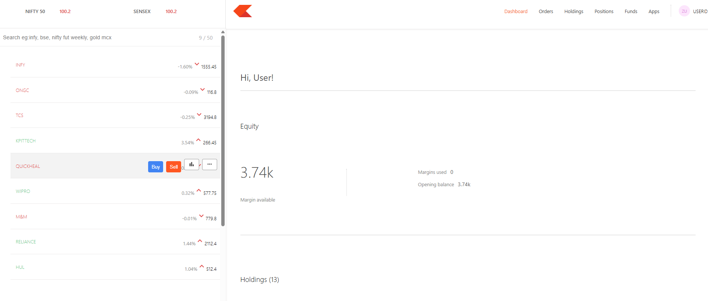
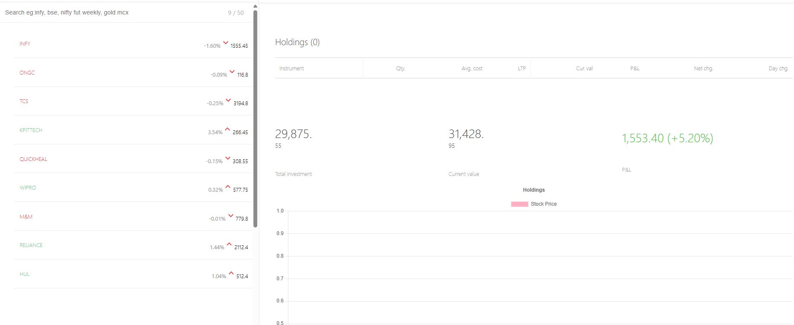
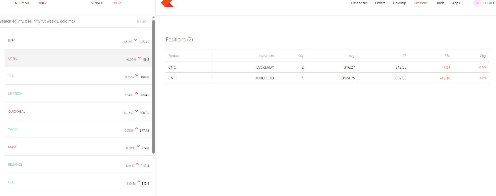
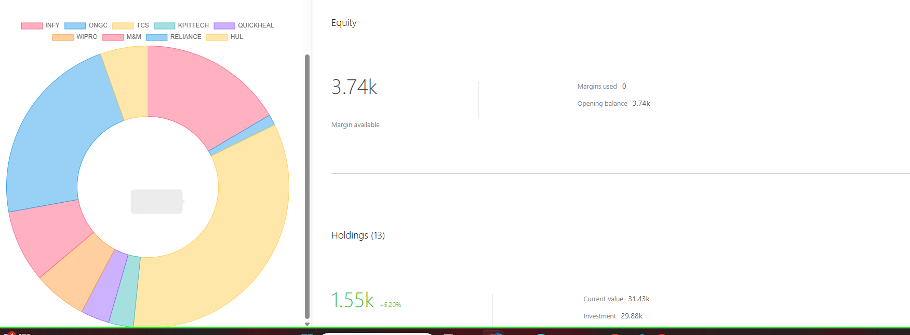
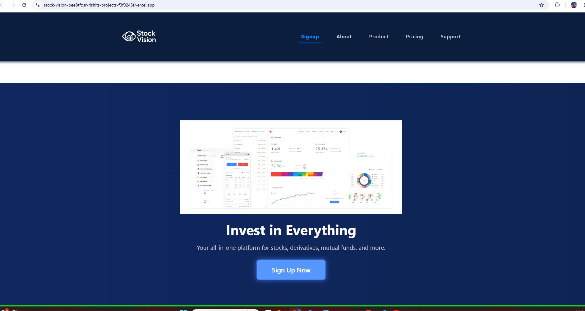

# 📈 Stock Vision

> A full-stack stock trading simulation platform with real-time dashboards, interactive analytics, and seamless trading experience. Built using the **MERN stack** + **Chart.js**, it empowers users to simulate real market decisions and track portfolio performance.
>  LIVE LINK: https://stock-vision-psi.vercel.app/
             
---

## 🖼️ Screenshots


### 📊 Dashboard View After Signup


### 💼 Portfolio Overview



### 📈 Stock Charts


### 📈 Front-End



## 🚀 Live Demo

**Frontend Deployed Here:**  
https://stock-vision-psi.vercel.app/ 
---

## 📌 Project Status

> ✅ **Work in Progress** – This project is actively being developed.

### ⚠️ Known Issues
- 🔧 Dashboard/backend connection currently shows **intermittent errors**
- 📉 Some issues with **order holding** and **buy/sell logic** – under debugging
- 📲 **Responsiveness and mobile scaling** under improvement
- 🧪 **Unit testing** implemented using **JEST**

Planned fixes and feature additions coming soon!

---

## ⚙️ Tech Stack

| Area         | Tech Used                          |
|--------------|-------------------------------------|
| Frontend     | React.js, Tailwind CSS, Chart.js    |
| Backend      | Node.js, Express.js, Mongoose       |
| Database     | MongoDB Atlas                       |
| Charts       | Chart.js (React integration)        |
| Auth         | JWT (JSON Web Tokens)               |
| Testing      | JEST                                |
| Hosting      | Vercel (Frontend), Render (Backend) |

---

## ✨ Features

- 🔐 **User Authentication** – Secure login and registration using JWT
- 📈 **Real-time Charts** – Live updates using Chart.js integration
- 💼 **Portfolio Management** – View and manage stock holdings
- 🛒 **Buy/Sell Simulation** – Virtual stock trading engine
- 📊 **Admin Dashboard** – Monitor system, users, and trades (planned)
- 📱 **Responsive UI** – Clean layout that adapts across screen sizes
- 🔍 **Data Visualization** – Track stock price changes over time

---

## 📁 Folder Structure
📦 stock-vision
├── client/ # React frontend
│ ├── components/
│ ├── pages/
│ └── App.js
├── server/ # Express backend
│ ├── controllers/
│ ├── models/
│ ├── routes/
│ └── index.js
├── screenshots/ # UI snapshots for README
├── README.md
└── .env.example # Environment variables (template)

---

## 🧪 Testing

- ✅ Unit testing done using **JEST**
- 📈 Future additions: Integration tests for API endpoints

---
## 🛠️ Getting Started

Follow the steps below to run the project locally. The app consists of three main parts:
- **Frontend (React.js)**
- **Backend (Node.js + Express)**
- **Database (MongoDB Atlas)**

> Make sure you have **Node.js**, **npm**, and **MongoDB Atlas URI** ready.

---

### 🔗  Clone the Repository

```bash
git clone https://github.com/YOUR_USERNAME/stock-vision.git
cd stock-vision


